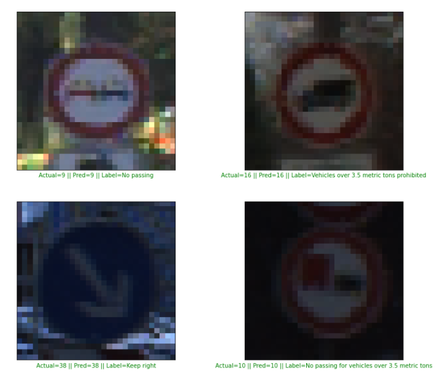

## Deep Learning
# Project: Traffic Sign Classification

### Overview
In this project, I used deep neural networks and convolutional neural network architectures to classify traffic signs. I will train the model so it can classify traffic sign images using the [German Traffic Sign Dataset](http://benchmark.ini.rub.de/?section=gtsrb&subsection=dataset). After the model is trained, I will test the model. Detailed description about my project is [Project Explanation Paper](http://benchmark.ini.rub.de/?section=gtsrb&subsection=dataset)

data set contents:
* The size of training set is: 34799
* The size of the validation set is: 4410
* The size of test set is: 12630
* The shape of a traffic sign image is: (32, 32 ,3)
* The number of unique classes/labels in the data set is: 43

[//]: # (Image References)
[exploratory]: ./result_images/exploratory.jpg "exploratory"
[distribution]: ./result_images/distribution.jpg "distribution"
[lenet]: ./result_images/lenet.png "lenet"
[alexnet]: ./result_images/alexnet.png "alexnet"
[inception]: ./result_images/inception.jpg "inception"
[googlenet]: ./result_images/GoogLeNet.png "googlenet"
[image2]: ./test_images/1.jpg "Traffic Sign 1"
[image3]: ./test_images/2.jpg "Traffic Sign 2"
[image4]: ./test_images/3.jpg "Traffic Sign 3"
[image5]: ./test_images/4.jpg "Traffic Sign 4"
[image6]: ./test_images/5.jpg "Traffic Sign 5"
[image7]: ./test_images/6.jpg "Traffic Sign 6"
[image8]: ./test_images/7.jpg "Traffic Sign 7"
[image9]: ./test_images/8.jpg "Traffic Sign 8"
[image10]: ./test_images/9.jpg "Traffic Sign 9"
[image11]: ./test_images/10.jpg "Traffic Sign 10"

## Outputs from project

